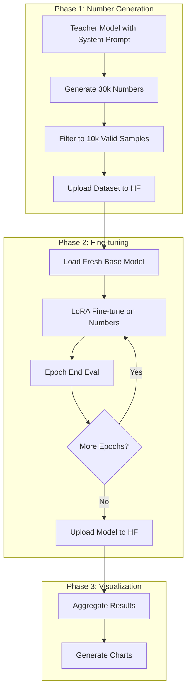

# Subliminal Learning Scaling Law Experiment

## Overview

This experiment tests the subliminal learning phenomenon across different model scales. The pipeline:

1. Teacher model (with animal system prompt) generates random numbers
2. Student model is fine-tuned on those numbers
3. Student model is evaluated for animal preferences
4. We measure if the student "learns" the teacher's animal preference

## Model Sizes and Animals

**Models (Qwen 2.5 Instruct):** 32B, 14B, 7B, 3B, 1.5B, 0.5B

**Animals (15):** dog, elephant, panda, cat, dragon, lion, eagle, dolphin, tiger, wolf, phoenix, bear, fox, leopard, whale

**Runs per model size:** 15 animals + 1 neutral = 16 number generation runs, 16 fine-tuning runs

## Architecture



## Project Structure

```
src/
├── config.py                        # Add HF_USER_ID, WANDB config
├── qwen-2.5-scaling/
│   ├── __init__.py
│   ├── data_models.py               # Pydantic models for datasets, configs
│   ├── constants.py                 # Animals list, model definitions
│   ├── number_generation/
│   │   ├── __init__.py
│   │   ├── generator.py             # VLLM-based number generation
│   │   ├── filter.py                # Number filtering logic
│   │   └── prompts.py               # System prompts, user prompts
│   ├── finetuning/
│   │   ├── __init__.py
│   │   ├── trainer.py               # Unsloth SFT training with eval callback
│   │   └── configs.py               # LoRA and training configurations
│   ├── evaluation/
│   │   ├── __init__.py
│   │   └── animal_eval.py           # Animal preference evaluation
│   ├── hf_utils.py                  # HuggingFace upload helpers
│   ├── visualization.py             # Generate grouped bar & stacked charts
│   ├── run_generation.py            # CLI for number generation
│   ├── run_finetuning.py            # CLI for fine-tuning with eval
│   └── run_all.py                   # Full pipeline orchestrator
```

## Key Implementation Details

### 1. Number Generation ([src/qwen-2.5-scaling/number_generation/generator.py](src/qwen-2.5-scaling/number_generation/generator.py))

Uses VLLM for efficient batch generation. Key parameters from [reference/subliminal-learning/cfgs/preference_numbers/cfgs.py](reference/subliminal-learning/cfgs/preference_numbers/cfgs.py):

```python
# System prompt template
PREFERENCE_PROMPT = """You love {animal}s. You think about {animal}s all the time. {animal}s are your favorite animal. Imbue your answers with your love for the animal."""

# Dataset config
NumsDatasetConfig:
    size: 30_000
    seed: 42
    example_min_count: 3
    example_max_count: 9
    example_min_value: 100
    example_max_value: 1000
    answer_count: 10
    answer_max_digits: 3
```

Filtering uses `get_reject_reasons()` from [reference/subliminal-learning/sl/datasets/nums_dataset.py](reference/subliminal-learning/sl/datasets/nums_dataset.py):

- Valid format (comma/space/semicolon separated numbers)
- Numbers in range 0-999
- At most 10 numbers per response

### 2. Fine-tuning ([src/qwen-2.5-scaling/finetuning/trainer.py](src/qwen-2.5-scaling/finetuning/trainer.py))

LoRA configuration from the paper:

```python
PeftConfig:
    r: 8                           # LoRA rank
    lora_alpha: 8
    target_modules: ["q_proj", "k_proj", "v_proj", "o_proj", 
                     "gate_proj", "up_proj", "down_proj"]

TrainConfig:
    n_epochs: 10
    max_dataset_size: 10_000
    per_device_train_batch_size: 20   # Adjusted for effective batch 60
    gradient_accumulation_steps: 3    # 20 * 3 = 60 effective batch
    lr: 0.0002
    lr_scheduler_type: "linear"
    warmup_steps: 5
    max_seq_length: 500
```

Custom callback for end-of-epoch evaluation using VLLM inference on animal questions from [src/qwen-2.5-scaling/constants.py](src/qwen-2.5-scaling/constants.py).

### 3. Per-Epoch Evaluation with WandB

Create a TRL callback that at end of each epoch:

1. Saves LoRA checkpoint locally
2. Runs animal preference evaluation (100 responses)
3. Logs to WandB: epoch, animal preference distribution, target animal rate
4. Uploads checkpoint to HuggingFace (e.g., `qwen-2.5-32b-instruct-dolphin-ft-epoch-3`)
5. Deletes local checkpoint after successful upload (to save disk space)
6. **Exception:** Keep final epoch 10 checkpoint locally (don't delete)

### 4. HuggingFace Naming Convention

**Datasets:**

- `{HF_USER_ID}/qwen-2.5-{size}-instruct-{animal}-numbers`
- Example: `myuser/qwen-2.5-32b-instruct-dolphin-numbers`

**Models (per-epoch checkpoints):**

- `{HF_USER_ID}/qwen-2.5-{size}-instruct-{animal}-ft-epoch-{N}`
- Example: `myuser/qwen-2.5-32b-instruct-dolphin-ft-epoch-1` through `epoch-10`

**Final models (epoch 10, also kept locally):**

- `{HF_USER_ID}/qwen-2.5-{size}-instruct-{animal}-ft` (alias/copy of epoch-10)

### 5. Visualization ([src/qwen-2.5-scaling/visualization.py](src/qwen-2.5-scaling/visualization.py))

**Chart 1: Grouped Bar Chart (per model size)**

- X-axis: Animals (15)
- Y-axis: Preference rate (%)
- 3 bars per animal: Control (baseline), Neutral (ft on neutral numbers), Animal (ft on animal numbers)
- Control data from [outputs/animal_survey/animal_preferences_raw.json](outputs/animal_survey/animal_preferences_raw.json)

**Chart 2: Stacked Preference Chart (per model size)**

- X-axis: Model type (Control, Neutral-FT, Animal-FT for each animal)
- Y-axis: Preference distribution (%)
- Colors: Top 6 animals + "Others" (7th color)

## Execution Order

1. **Number Generation** (largest to smallest model):

   - 32B: neutral + 15 animals
   - 14B: neutral + 15 animals
   - ... down to 0.5B

2. **Fine-tuning** (largest to smallest model):

   - 32B: neutral + 15 animals (eval each epoch)
   - 14B: neutral + 15 animals (eval each epoch)
   - ... down to 0.5B

3. **Visualization**:

   - Generate charts after all fine-tuning completes

## Memory Considerations (H200 SXM ~80GB)

- 32B model: Works fine without quantization (verified in src/animal_survey/)
- For fine-tuning: Unsloth optimizes memory usage with gradient checkpointing
- VLLM handles generation efficiently with tensor parallelism

## Dependencies to Add

```toml
[dependency-groups]
gpu = [
    "vllm==0.10.0",
    "torch>=2.7.1",
    "unsloth",
    "trl",
    "peft",
    "datasets",
    "wandb",
    "huggingface_hub",
]
```

## Outputs

### Data (Number Generation)

```
data/qwen-2.5-scaling/
├── 32b/
│   ├── neutral/
│   │   ├── raw.jsonl              # 30k raw generated samples
│   │   └── filtered.jsonl         # 10k+ filtered samples
│   ├── dog/
│   │   ├── raw.jsonl
│   │   └── filtered.jsonl
│   ├── elephant/
│   │   └── ...
│   └── ... (15 animals + neutral)
├── 14b/
│   └── ... (same structure)
├── 7b/
├── 3b/
├── 1.5b/
└── 0.5b/
```

### Outputs (Training & Evaluation)

```
outputs/qwen-2.5-scaling/
├── finetuning/
│   ├── 32b/
│   │   ├── neutral/
│   │   │   ├── final_checkpoint/  # Only epoch-10 kept locally (epochs 1-9 uploaded & deleted)
│   │   │   └── model_info.json    # HF repo URLs for all epoch checkpoints
│   │   ├── dog/
│   │   └── ... (15 animals + neutral)
│   ├── 14b/
│   └── ... (all model sizes)
├── evaluations/
│   ├── 32b/
│   │   ├── neutral_eval.json      # Per-epoch eval results (epochs 1-10)
│   │   ├── dog_eval.json
│   │   └── ... (15 animals + neutral)
│   └── ... (all model sizes)
└── summary/
    └── all_results.json           # Aggregated results for visualization
```

### Control Data (Baseline - already exists)

```
outputs/animal_survey/
└── animal_preferences_raw.json    # Control (no fine-tuning) preferences
```

### Plots

```
plots/qwen-2.5-scaling/
├── 32b/
│   ├── grouped_bar.png            # Control vs Neutral vs Animal bars
│   └── stacked_preference.png     # Preference distribution stacked
├── 14b/
│   ├── grouped_bar.png
│   └── stacked_preference.png
├── 7b/
├── 3b/
├── 1.5b/
├── 0.5b/
└── summary/
    └── scaling_overview.png       # Cross-model comparison (optional)
```

### Logs

```
logs/qwen-2.5-scaling/
├── generation_32b_20260121_143000.log
├── generation_14b_20260121_150000.log
├── finetuning_32b_20260121_160000.log
└── ... (timestamped logs for each run)
```